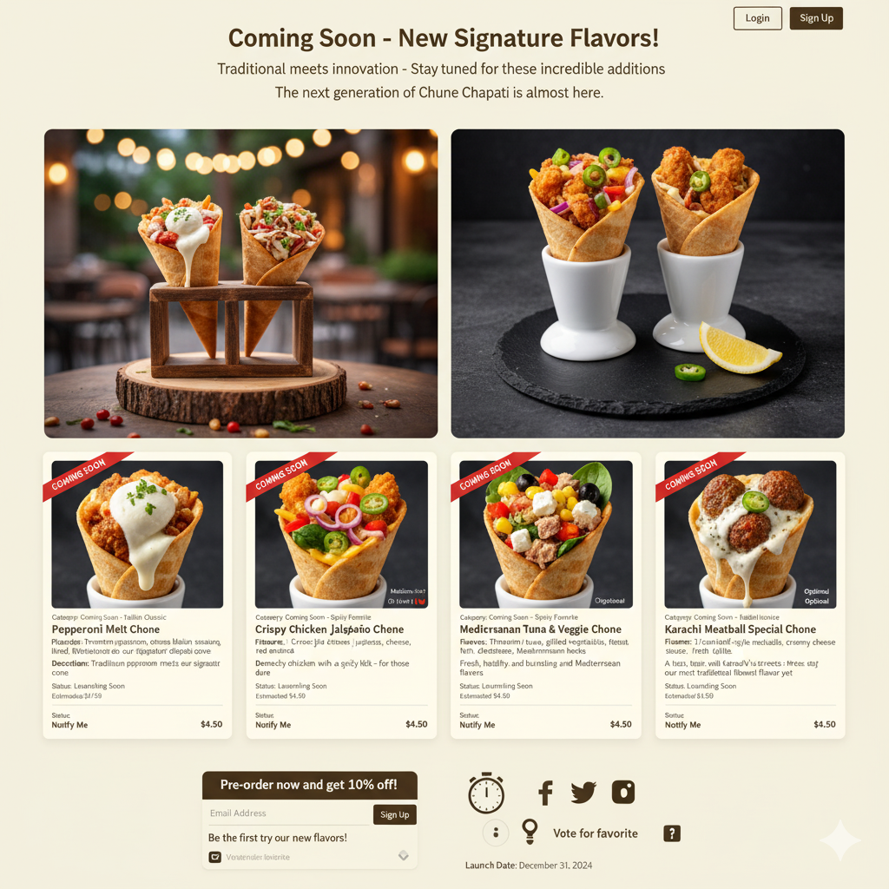
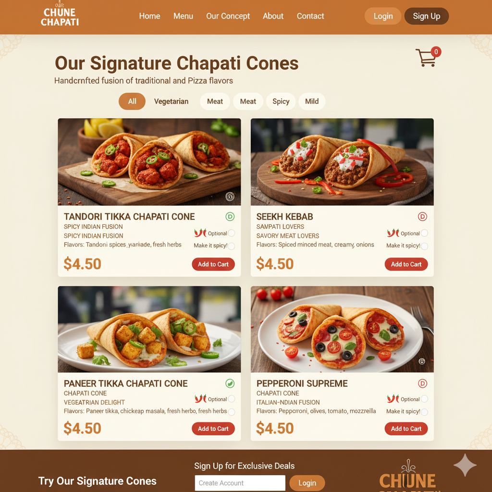
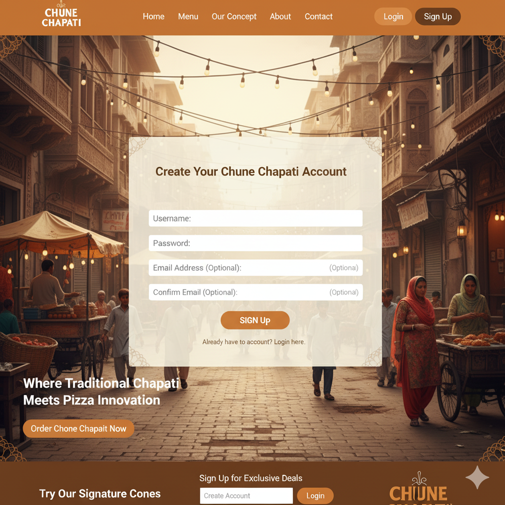

# project2---chone-chapti
The Chone Chapati Concept  Chone Chapati is a revolutionary food concept dedicated to marrying the authentic comfort of home-cooked, flaky "Saa'd's Heritage Dough" chapati with the convenience of a handheld cone
Chone Chapati: Brand Identity
This document outlines the core mission, product concepts, and unique selling propositions (USPs) for the Chone Chapati restaurant, based on the founder Saa'd Al-Deen Hikmatyaar's story.
Core Brand Narrative & Mission
Category
Detail
Founder
Saa'd Al-Deen Hikmatyaar
The Core Mission
To deliver food that is Authentic, Innovative, and Uncompromisingly Fresh, marrying the comfort of Saa'd's home-cooked chapati with the convenience of a handheld cone.
Slogan
"The Cone, Reinvented. Freshness Wrapped. Flavor Delivered."

Product Differentiation & Technology
Category
Detail
The Chapati Cone
Named "Saa'd's Heritage Dough"—a light, flaky blend of whole wheat and fine flour, lightly brushed with Ghee and molded into a cone.
The Solution
"Sealed Base Technology"—A proprietary sealing process at the base of the cone (using a special cheese/ghee blend and the "Twisted Tip") to guarantee the Zero Mess promise.

Signature Flavors & Future Vision
Category
Detail
Signature Savory Sauce
"The Hikmatyaar Heat"—A creamy, tangy base infused with a kick of green chilies and tamarind, reflecting Karachi's vibrant spice markets.
Signature Sweet
"Karachi Chocolate"—Dark chocolate ganache infused with a hint of rosewater, topped with crushed pistachios and sweet vanilla cream.
Future Flavors
The Mughlai Masala Chone (Butter Chicken/Paneer) and Summer Mango Delight Chone (Mango Lassi flavor).

### ERD 
[Lucid](https://lucid.app/lucidchart/484c3220-018b-4494-adfb-8c50132e166d/edit?viewport_loc=29%2C35%2C2139%2C994%2C0_0&invitationId=inv_d2aa9932-6bc8-4d7b-a6c7-22cdac50a02c)

### WireFrame

